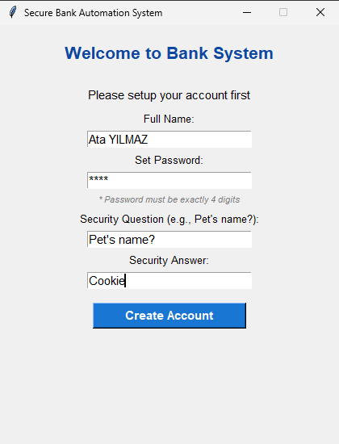
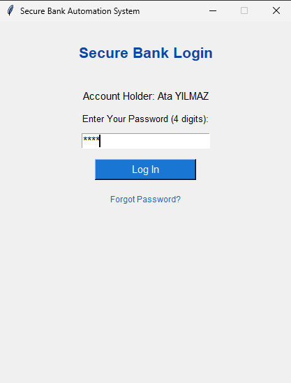
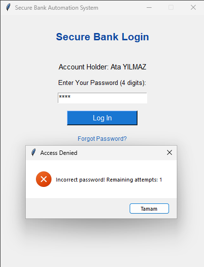
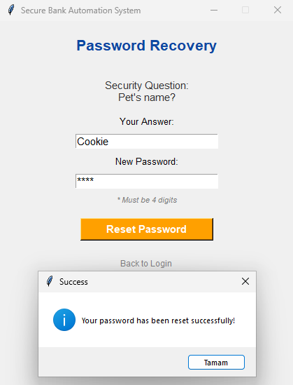
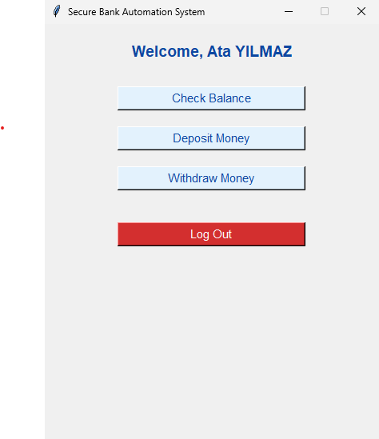
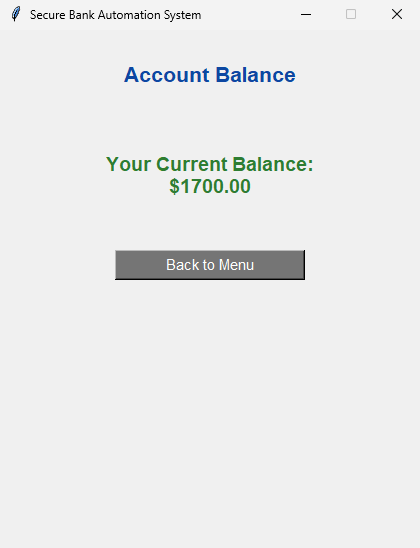
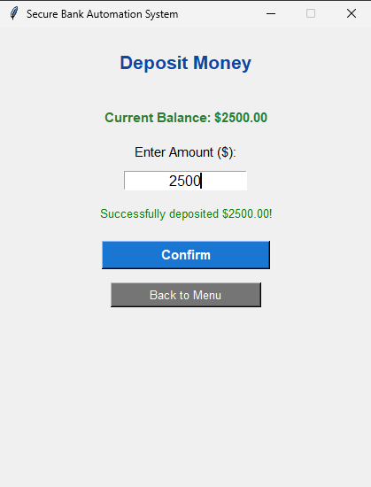
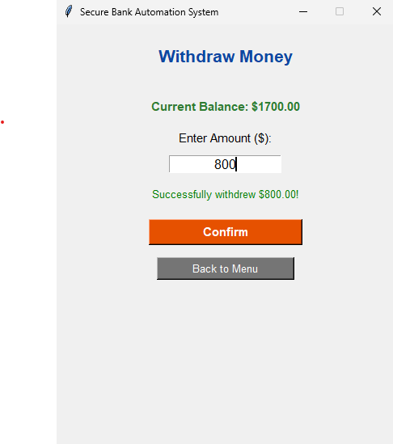

# 🏦 Secure Desktop Banking System

A secure, multi-layer desktop banking application built with **Python** and **Tkinter**. This project features user account setup with strict password validation, secure login with brute-force protection (3-attempt lock), a built-in password recovery mechanism, and an intuitive graphical user interface (GUI) with a professional banking blue theme.

## 🚀 Features

- **Account Setup:** Custom account creation with name, 4-digit numeric password enforcement, and a custom security question/answer for recovery.
- **Secure Login & Lockout Protection:** Password validation system with a 3-attempt limit. Exceeding attempts automatically redirects the user to the password recovery screen.
- **Password Recovery:** Secure account recovery using the pre-defined security question.
- **Multi-Layer UI Navigation:** Clean, step-by-step graphical workflow (no annoying pop-ups for transactions).
- **Live Balance Tracking:** Real-time balance updates during deposit and withdrawal operations.

---

## 📸 App Screenshots

| Account Setup | Login Screen |
| :---: | :---: |
|  |  |

| Error Screen (3 Attempts) | Password Recovery |
| :---: | :---: |
|  |  |

| Main Menu | Account Balance |
| :---: | :---: |
|  |  |

| Deposit Panel | Withdraw Panel |
| :---: | :---: |
|  |  |

---

## 🛠️ Technologies Used

- **Python 3.x**
- **Tkinter** (Standard Python GUI library)

---

## ⚙️ How to Run

1. Make sure you have Python installed on your system.
2. Clone the repository or download the source code:
   ```bash
   git clone [https://github.com/ata-yilmaz/python-secure-bank-system.git](https://github.com/ata-yilmaz/python-secure-bank-system.git)
